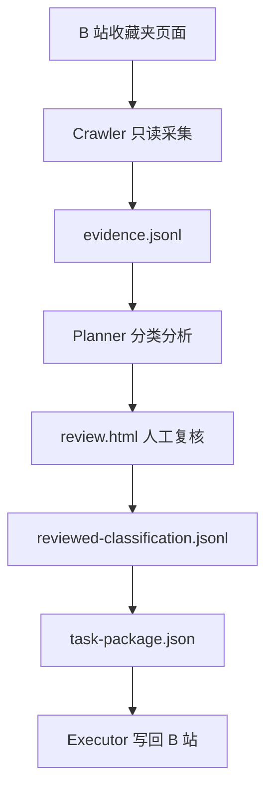

# Bilibili Favorites Organizer


Bilibili Favorites Organizer 是一套本地优先的 B 站收藏夹整理流程。它先只读采集收藏夹数据，再在本地生成分类建议和人工复核页，最后才把人工审核过的任务包交给执行器写回 B 站。

## 开源拆分建议

建议按 **一个产品、两个仓库** 开源：

- `bilibili-favorites-planner`：Crawler + Planner + 复核页 + 数据契约 + 文档。
- `bilibili-favorites-executor`：独立 Executor userscript。

原因：

- Crawler 和 Planner 都是只读或本地文件处理，用户体验上属于“执行前准备流程”。
- Executor 是唯一会写 B 站的组件，风险、测试和版本节奏应该独立。
- 后续 Planner 可以切换规则/模型，不影响写操作执行器。

## 总流程



## 效果图


## 安装

普通用户安装三样东西：

1. **Codex Skill**：让 Codex 自动识别 B 站收藏夹整理任务，并在本地生成复核页和任务包。
2. **Crawler userscript**：装到 Chrome/Tampermonkey，用来只读采集收藏夹。
3. **Executor userscript**：装到 Chrome/Tampermonkey，用来导入任务包并写回 B 站。

### 1. 安装 Codex Skill

在 Codex 里安装这个 Skill：

```text
https://github.com/nj-zhangrui-arvin/bilibili-favorites-planner/tree/main/skills/bilibili-favorites-planner
```

安装后重启 Codex。之后用户把 JSONL 文件交给 Codex，说“生成复核页”或“生成任务包”，Codex 会自动使用 `bilibili-favorites-planner` Skill。

给 Codex 的示例提示：

```text
请用 bilibili-favorites-planner skill，帮我从这个 evidence JSONL 生成复核页。
```

复核完成后：

```text
请用 bilibili-favorites-planner skill，帮我从 reviewed-classification.jsonl 生成 Executor 任务包。
```

### 2. 安装 Crawler 脚本

在 Chrome 安装 Tampermonkey，然后打开下面的脚本地址安装：

```text
https://raw.githubusercontent.com/nj-zhangrui-arvin/bilibili-favorites-planner/main/scripts/bilibili_favorites_crawler.user.js
```

Crawler 只负责读取收藏夹并导出 JSONL，不写入 B 站。

### 3. 安装 Executor 脚本

Executor 是单独仓库，只有它会执行写回：

```text
https://github.com/nj-zhangrui-arvin/bilibili-favorites-executor
```

### 开发者手动模式

熟悉终端的用户也可以直接克隆仓库运行 Node 脚本：

```bash
git clone https://github.com/nj-zhangrui-arvin/bilibili-favorites-planner.git
cd bilibili-favorites-planner
npm run validate:examples
node scripts/run-planner.mjs auto ~/Downloads/bilibili-favorites-evidence.jsonl
```

## 快速开始

1. 安装 Codex Skill、Crawler userscript 和 Executor userscript。
2. 打开自己的 B 站收藏夹页面。
3. 先点 `测试采集`，确认能下载 `bilibili-favorites-test-evidence.jsonl`。
4. 测试正常后点 `导出收藏夹 JSONL`，得到 `bilibili-favorites-evidence.jsonl`。
5. 把 evidence 文件交给 Codex，让 Skill 生成并打开 `review.html`。
6. 在复核页人工确认分类，导出 `reviewed-classification.jsonl`。
7. 把 reviewed 文件交给 Codex，让 Skill 生成 `task-package.json`。
8. 在 Executor 导入任务包，小批量执行。

完整说明见 [用户手册](docs/user-guide.md)。

## 核心文件

- `evidence.jsonl`：Crawler 只读采集结果。
- `classification-review.jsonl`：Planner 分类建议和待复核字段。
- `review.html`：本地人工复核页。
- `reviewed-classification.jsonl`：人工审核后的真源文件。
- `task-package.json`：Executor 可执行任务包。

格式说明见 [数据契约](docs/data-contracts.md)。

## 安全边界

- Crawler 只读 B 站收藏夹数据。
- Planner 只处理本地文件。
- 复核页只导入/导出本地 JSONL。
- Executor 是唯一写 B 站的组件。
- 不要求用户填写 Cookie、SESSDATA、csrf 或账号密码。
- 不存在从采集到写入的全自动链路，必须经过人工复核。

详细说明见 [安全模型](docs/safety-model.md)。

## 文档

- [用户手册](docs/user-guide.md)
- [流程说明](docs/workflow.md)
- [整体架构](docs/architecture.md)
- [安全模型](docs/safety-model.md)
- [人工复核](docs/human-review.md)
- [数据契约](docs/data-contracts.md)
- [故障排查](docs/troubleshooting.md)
- [路线图](docs/roadmap.md)
- [开发说明](docs/development.md)
- [贡献指南](docs/contributing.md)

## 合规与平台边界

本项目是非官方本地工具，与 Bilibili 或上海宽娱数码科技有限公司无任何关联，也未获得其背书、赞助或授权。

请只用于管理自己账号下的收藏夹。不要用于第三方账号、商业化数据抓取、刷量、绕过平台限制或影响平台服务稳定性。自动化读取和写入都可能触发平台风控，例如 403、412、验证码或登录校验。

使用前请自行理解风险，并在执行前备份。

## License

MIT
