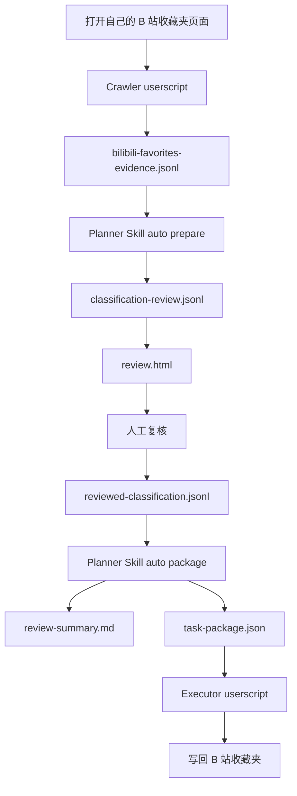
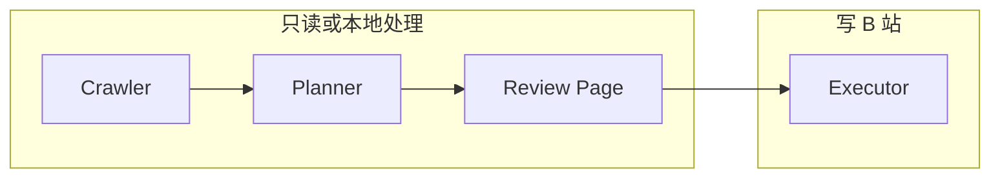

# 流程说明

## 主流程

## 读写边界

## 每一步输入输出

| 阶段 | 输入 | 输出 | 是否写 B 站 |
| --- | --- | --- | --- |
| Crawler | 已登录收藏夹页面 | `evidence.jsonl` | 否 |
| Planner prepare | `evidence.jsonl` | `classification-review.jsonl`, `review.html` | 否 |
| 人工复核 | `review.html` | `reviewed-classification.jsonl` | 否 |
| Planner package | `reviewed-classification.jsonl` | `task-package.json` | 否 |
| Executor | `task-package.json` | B 站收藏夹变化、执行报告 | 是 |

## 人工停止点

流程刻意保留两个停止点：

- 生成复核页后，必须人工确认分类。
- 生成任务包后，必须人工导入 Executor 并启动执行。

不存在“采集后自动写回 B 站”的路径。
